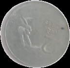
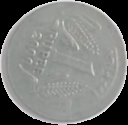
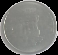
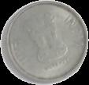
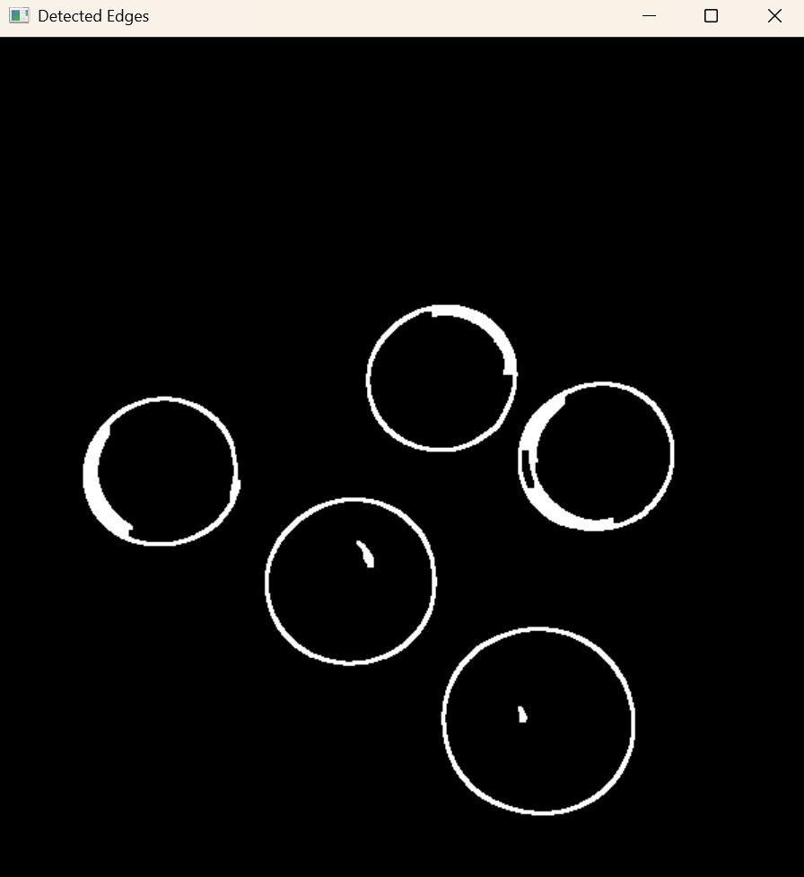
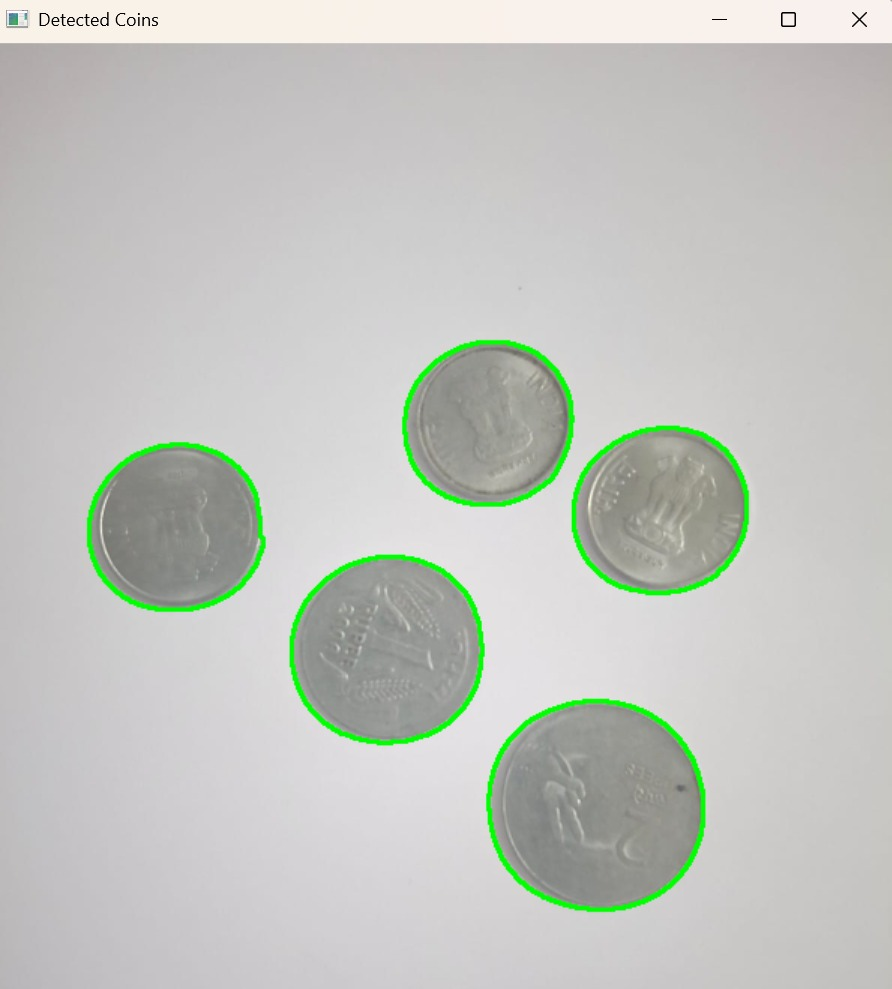
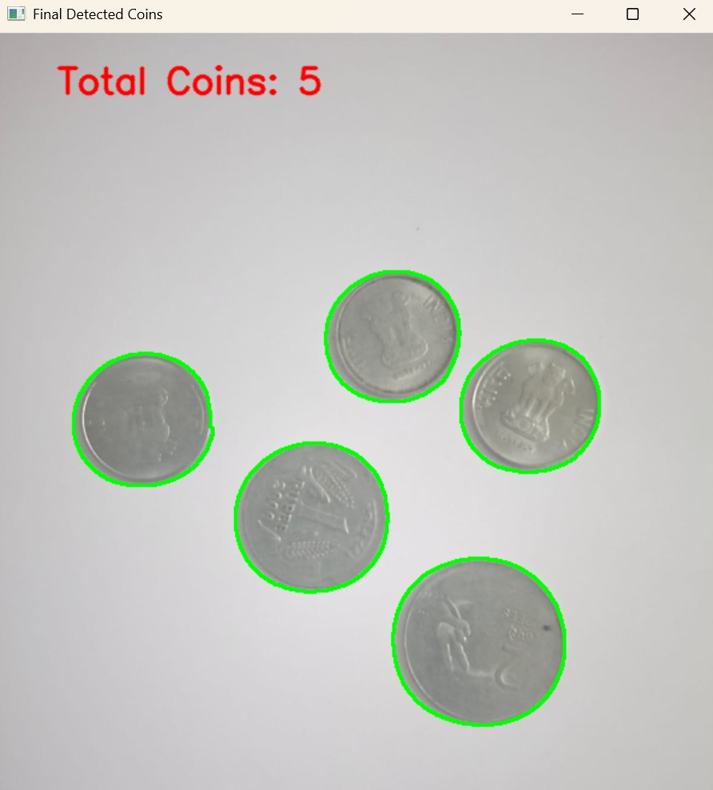

# Project Title

## Introduction
This is assignment 1 of the course Visual Recognition.

## Prerequisites
Ensure you have the following installed before running the code:
- **Python 3.10**
- **NumPy**
- **OpenCV(cv2)**
- **Matplotlib**

## Installation
1. **Clone this repository**:
   ```sh
   git clone https://github.com/sassy2711/VR_Assignment1_ShashwatChaturvedi_IMT2022118.git
   cd VR_Assignment1_ShashwatChaturvedi_IMT2022118.git
   ```
## How to Run
Go to the scripts folder
Coins segmentation script - execute the cells in coins.ipynb.
Panorama stiching script - execute the cells in panorama.ipynb

## Methods Chosen

### Coin Detection:-
- **GaussianBlur**: For noise reduction.
- **Canny**: For edge detection.
- **morphologyEx**: For closing small gaps in edges.
- **findContours**: For finding contours from improved edges.
- **Segmentation**: For extracting coins from the image.

### Panorama Stiching:-
- **ORB (Oriented FAST and Rotated BRIEF)**: For detecting key points and computing descriptors.
- **BFMatcher**: For matching ORB descriptors between consecutive images using Brute-Force Matching with Hamming distance.
- **findHomography**: Computes homography matrix using RANSAC.
- **warpHomography**: Warps images using homography.
- **threshold**: Creates a binary mask to remove black areas.

## Results

### Coin detection:-









### Panorama Stiching:-


## Observations
- **[1]**: A few of the inscribings in the coins were also detected as edges.
- **[2]**: A slight seam is visible in the stitched panorama. It may be due to misalignment, exposure differences, poor blending, or lens artifacts like vignetting.

## License
This project is licensed under the **[MIT License](LICENSE)**.

